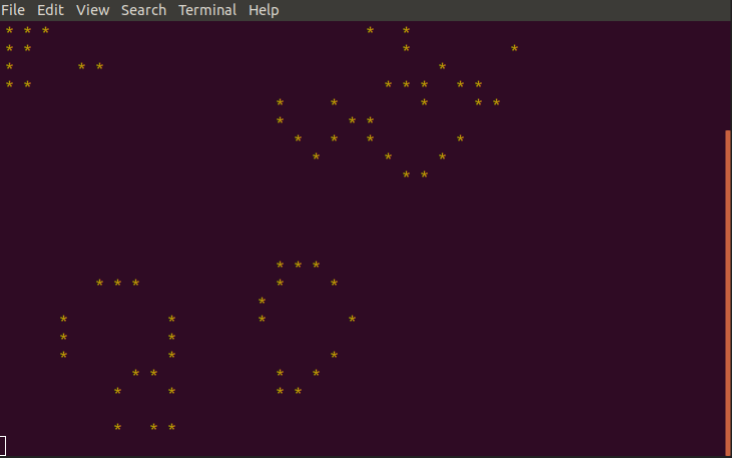

# Лабораторна 1: Консольна аплікація

## Завдання
Життя

## Додаткова інформація
Файли, що містять у даному репозиторії код розробленої консольної аплікації 'Життя' - мають назви 'index.js' та 'package.json'. 
## Скріншоти

